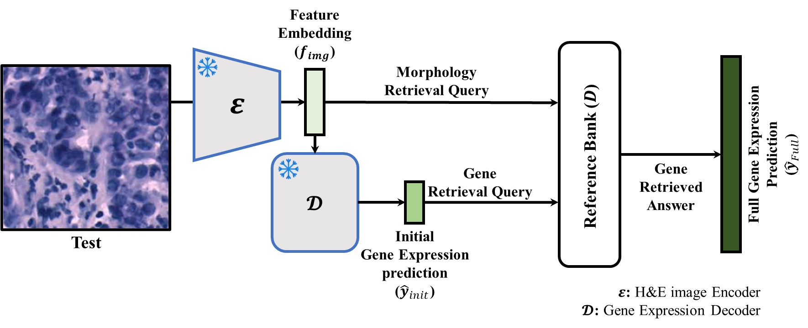
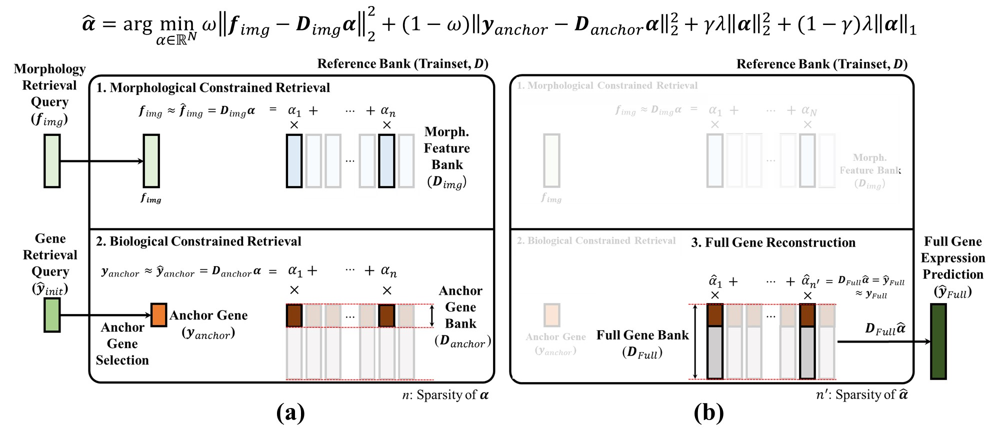

# GeneRAG

**A Retrieval-Augmented Framework for Spatially Resolved Gene Expression Prediction.**

[](https://hyeongsubkim.github.io/GeneRAG-project-page)
[](#)
[](LICENSE)
[](#)

🌐 **Project page:** <https://hyeongsubkim.github.io/GeneRAG-project-page>

> Spatial transcriptomics (ST) is pivotal for deciphering molecular
> organization, yet cross-modal variability challenges accurate H&E-based
> profiling. Existing models struggle to generalize to unseen genes and
> lack clinical interpretability. **GeneRAG** is a *model-agnostic*
> retrieval-augmented framework with a **Dual-Constrained Retrieval**
> module: it decouples knowledge storage from model training, optimizes
> an ElasticNet-based sparse sampling matrix that fuses morphological and
> biological constraints, and reconstructs full transcriptomic profiles
> — including entirely unseen genes — by exploiting conserved
> gene-to-gene correlations.

## Highlights

- **Plug-and-play** on top of any Image-to-ST backbone (Stem, UNI,
  EXAONE Path 2.5, …) with **no structural modification**.
- **Massive-scale zero-shot prediction**: up to 5,000 unseen genes per
  spot from a single forward pass + convex retrieval.
- **Inherently transparent**: ~50 retrieved reference patches per spot
  (sparse α), each weight ``α_i`` directly interpretable as the
  contribution of one training spot.
- **GPU-accelerated**: batched FISTA solves the joint multi-output
  ElasticNet for an entire test slide in a single pass on one GPU.

---

## How GeneRAG works



*Overview of GeneRAG. At test time a frozen H&E image encoder ``E`` turns
the input patch into a feature embedding ``f_img`` (the **morphology
retrieval query**), while a frozen gene-expression decoder ``D`` produces
an initial prediction ``ŷ_init`` (the **gene retrieval query**). Together
these form a hybrid query into the pre-built **Reference Bank ``D``**,
whose retrieved answer is reconstructed into the **full gene-expression
prediction ``ŷ_Full``** — including genes never seen by the backbone. The
encoder and decoder stay frozen; all adaptation happens in the
retrieval.*

The retrieval itself is detailed below.



*Dual-Constrained Retrieval. **(a)** A single sparse code ``α`` is solved
jointly against two constraints over the frozen training **Reference Bank
``D``**: a **Morphological** constraint that reconstructs the query image
embedding ``f_img`` from the morphology feature bank ``D_img``, and a
**Biological** constraint that reconstructs the selected **anchor genes**
``y_anchor`` from the anchor-gene bank ``D_anchor``. **(b)** The same
sparse code is then applied to the **full gene bank ``D_Full``** to
reconstruct the complete transcriptome ``ŷ_Full`` — including genes never
seen in the anchor panel.*

The whole method is two equations.

**Eq. 1 — Dual-Constrained Retrieval.** Solve one ElasticNet for the
sparse sampling vector ``α`` shared by both modalities:

$$
\hat\alpha = \arg\min_{\alpha \in \mathbb{R}^N}\; \underbrace{\omega\|f_\text{img} - D_\text{img}\alpha\|_2^2}_{\text{morphological}} + \underbrace{(1-\omega)\|y_\text{anchor} - D_\text{anchor}\alpha\|_2^2}_{\text{biological}} + \underbrace{\gamma\lambda\|\alpha\|_2^2 + (1-\gamma)\lambda\|\alpha\|_1}_{\text{ElasticNet regularization}}.
$$

**Eq. 2 — Full reconstruction.** Re-use ``α̂`` against the full gene bank:

$$
\hat y_\text{full} = D_\text{full} \cdot \hat\alpha.
$$

### Notation

| Symbol | Meaning | Code argument |
|---|---|---|
| ``f_img`` | frozen-encoder embedding of the query H&E patch | `test_embeddings` |
| ``y_anchor`` | initial anchor-gene prediction for the query spot (``ŷ_init``) | `test_anchor` |
| ``D_img`` | morphology feature bank — embeddings of all training spots | `bank_embeddings` |
| ``D_anchor`` | anchor-gene bank — anchor-gene rows of all training spots | (slice of `bank_expression`) |
| ``D_full`` | full gene bank — complete transcriptome of all training spots | `bank_expression` |
| ``α̂`` | sparse sampling vector over the ``N`` training spots (~50 nnz) | returned internally |
| ``ŷ_full`` | predicted full transcriptome for the query spot | `predictions` |

### Why it works

- **One code, two views.** ``ω`` balances the morphological vs. biological
  constraint, so a single ``α̂`` must explain the query *both* in image
  space *and* in gene space — this is what keeps retrieval grounded.
- **Sparse by construction.** ``γ`` trades L2 shrinkage against L1
  sparsity; the resulting ``α̂`` activates only ~50 training spots
  (``n′`` in panel **(b)**), each weight ``α_i`` directly readable as the
  contribution of one annotated training spot.
- **Unseen-gene generalization.** Eqs. 1 and 2 share ``α̂`` but use
  *different* banks. Because gene-to-gene correlations are conserved
  across spots, a code fit on the anchor panel transfers to ``D_full``,
  letting GeneRAG reconstruct thousands of genes that were never used as
  constraints.
- **Training-free adaptation.** Everything downstream of the frozen
  encoder is a convex solve against the Reference Bank — swap the bank and
  the model adapts to a new tissue/domain with **no weight updates**.

---

## Installation

Requires Python 3.9+.

```bash
git clone https://github.com/HyeongSubKim/GeneRAG
cd GeneRAG

python -m venv .venv
source .venv/bin/activate              # Windows:  .venv\Scripts\activate

# Install PyTorch first using a wheel matched to your CUDA driver.
# (PyPI's default `torch` wheel ships against the newest CUDA toolkit
#  and may not match the installed NVIDIA driver — pin the index URL.)
nvidia-smi | head -1                                                      # check your CUDA version
pip install torch --index-url https://download.pytorch.org/whl/cu126      # CUDA 12.6 example
# Other options:
#   https://download.pytorch.org/whl/cu121     # CUDA 12.1
#   https://download.pytorch.org/whl/cu118     # CUDA 11.8
#   https://download.pytorch.org/whl/cpu       # CPU-only fallback

# Install GeneRAG (editable) + optional helpers.
pip install -e ".[all]"
```

**Extras** (defined in ``pyproject.toml``):

| Extra | What it adds |
|---|---|
| ``io`` | `anndata` — used by the `.h5ad` I/O helpers in `generag.data` |
| ``viz`` | `matplotlib` |
| ``dev`` | `pytest`, `ruff` |
| ``all`` | `io + viz` |

The GPU solver dispatches to a PyTorch + CUDA batched FISTA backend
whenever ``device='cuda'`` is requested; a pure-CPU scikit-learn
fallback is always available.

Sanity-check the install:

```bash
python -c "import torch; print('cuda:', torch.cuda.is_available())"
python examples/quickstart.py
```

---

## 30-second usage

```python
from generag import GeneRAG

# 1) Build the model from any in-memory reference bank.
model = GeneRAG(
    bank_expression=bank_df,           # (n_bank_spots, n_genes) DataFrame  (≡ D_full)
    bank_embeddings=bank_embeddings,   # (n_bank_spots, d) — optional        (≡ D_img)
    anchor_genes=anchor_gene_list,     # list of gene names                  (≡ D_anchor)
    n_high_variable_genes=10_000,
)

# 2) Predict full gene expression for any new spots (one solve, all spots together).
predictions, mean_sparsity = model.predict(
    test_anchor=test_pred_df,          # (n_test_spots, n_anchor_genes)     (≡ y_anchor)
    test_embeddings=test_embeddings,   # (n_test_spots, d) — optional       (≡ f_img)
    method='elasticnet',
    alpha=0.01, l1_ratio=0.9,          # λ, γ in Eq. (1)
    embedding_ratio=0.75,              # ω in Eq. (1)
    positive=True,
    device='cuda',
)
# predictions: DataFrame (n_test_spots × n_high_variable_genes)  (≡ ŷ_full)
```

Run a fully self-contained synthetic example:

```bash
python examples/quickstart.py
```

---

## End-to-end pipeline (real data, paper reproduction)

For real spatial-transcriptomics data the full path looks like this — each step lives
in its own notebook under [`examples/notebooks/`](examples/notebooks/):

| Stage | Notebook | What happens |
|---|---|---|
| **1. Download** | `01_download_data.ipynb` | Pull HEST-1k slides (PRAD / Kidney / HER2ST / Mouse Brain) from HuggingFace into `./hest1k_datasets/<organ>/`. |
| **2. Build bank** | `02_build_bank.ipynb` | Select the anchor gene panel (HVG → MT/RPS/RPL filter → top-mean ∩ top-std), then extract per-spot frozen-encoder embeddings (UNI / CONCH / EXAONE Path 2.5 / …) as `.pt` files. |
| **3. Linear probing** | `03_linear_probing.ipynb` | Train a single linear head on the frozen embeddings to produce `ŷ_init` for every test spot; saves `.pt` files into `init_pred_fm_pt/`. |
| **4. Retrieval** | `examples/run_experiment.py` | Sweep GeneRAG over the (backbone × anchor-gene-list) combinations produced above and write per-experiment CSV metrics. |

For a one-shot smoke test that does not need any of the above:

```bash
python examples/quickstart.py      # runs on synthetic in-memory data
```

---

## Repository layout

```
GeneRAG/
├── generag/                # the Python package
│   ├── core.py             # GeneRAG class — the plug-and-play API
│   ├── solvers.py          # GPU (FISTA) + scikit-learn dispatcher
│   ├── data.py             # bank construction + .h5ad / .pt I/O helpers
│   ├── metrics.py          # PCC@K, MSE, MAE, RVD
│   ├── experiment.py       # multi-GPU hyperparameter sweep runner
│   └── utils.py            # device selection, seeding
├── examples/
│   ├── notebooks/
│   │   ├── 01_download_data.ipynb     # HEST-1k download         → hest1k_datasets/<ORGAN>/{st,wsis}/
│   │   ├── 02_build_bank.ipynb        # anchor gene + embeddings → hest1k_datasets/<ORGAN>/processed_data/
│   │   └── 03_linear_probing.ipynb    # linear probe ŷ_init       → hest1k_datasets/<ORGAN>/init_pred_fm_pt/
│   ├── quickstart.py       # plug-and-play demo on synthetic data
│   ├── benchmark.py        # slide-wise / spot-wise wall-time measurement
│   └── run_experiment.py   # paper-style sweep over (backbone × gene-list)
├── hest1k_datasets/        # all dataset-scoped artefacts (notebooks + run_experiment all read/write here)
│   └── PRAD/
│       ├── st/                          # .h5ad slides (from notebook 01)
│       ├── wsis/                        # .tif images  (from notebook 01)
│       ├── processed_data/              # anchor gene lists + per-spot embeddings (notebook 02)
│       ├── init_pred_fm_pt/             # linear-probe predictions (notebook 03)
│       └── results/                     # GeneRAG sweep CSVs (run_experiment.py)
├── pyproject.toml          # pip-installable package metadata
└── LICENSE                 # MIT
```

---

## Datasets and backbones

The paper evaluates on three organs from **HEST-1k**:

- **Breast (HER2ST)** — top-300 HVGs for Core HVG; top-5,000 for Global HVG
- **Kidney** — top-200 HVGs for Core HVG; top-5,000 for Global HVG
- **Prostate** — top-200 HVGs for Core HVG; top-5,000 for Global HVG

Backbones validated as drop-in encoders include:

- **Stem** (diffusion generative ST model)
- **UNI** (pathology H&E foundation model)
- **EXAONE Path 2.5** (multi-modal H&E + omics foundation model)

GeneRAG is architecture-agnostic: any frozen encoder ``E`` and any frozen
ŷ_init decoder ``D`` whose outputs can be cast into ``f_img`` and
``y_anchor`` will plug in.

---

## Reproducing the paper

```python
from generag.experiment import run_sweep

results = run_sweep(
    bank_expression=bank_df,
    test_anchor=test_anchor_df,
    test_gt=ground_truth_df,
    anchor_genes=anchor_gene_list,
    bank_embeddings=bank_emb, test_embeddings=test_emb,
    search_space={
        'elasticnet': {
            'alpha': [0.001, 0.01, 0.1],     # λ in Eq. (1)
            'l1_ratio': [0.5, 0.9],          # 1 - γ in Eq. (1)
            'embedding_ratio': [0.0, 0.5, 0.75, 1.0],  # ω in Eq. (1)
            'positive': [True],
        },
    },
    n_jobs=4,                                  # round-robin across GPUs
    output_csv='results/sweep.csv',
)
```

A full end-to-end driver matching the paper's experiments (with bank
construction, anchor selection, and per-slide evaluation) lives in
``examples/run_experiment.py``.

---

## Solver backends

| Method | GPU (batched FISTA, PyTorch) | CPU (scikit-learn) |
|---|:-:|:-:|
| ElasticNet (used in Eq. 1) | ✅ batched | ✅ |
| Lasso | ✅ batched | ✅ |
| Ridge | ✅ closed-form | ✅ |
| OMP | – | ✅ |
| LassoLars | – | ✅ |
| Bayesian Ridge | – | ✅ |
| NNLS | – | ✅ |

The GPU backend matches scikit-learn's loss definition exactly; on
production data we measured reconstruction Pearson ``r ≈ 0.999`` between
the two backends, with the GPU path running ~25–70× faster.

---

## Citation

```bibtex
@inproceedings{generag2026,
  title     = {GeneRAG: A Retrieval-Augmented Framework for Spatially
               Resolved Gene Expression Prediction},
  author    = {Kim, Hyeongsub and Kim, Sihyun and Cho, Minyoung and
               Jo, Sanghyun and Lee, Minhyeong and Kim, Kyungsu},
  booktitle = {Medical Image Computing and Computer Assisted Intervention --
               MICCAI 2026},
  series    = {Lecture Notes in Computer Science},
  publisher = {Springer Nature Switzerland},
  year      = {2026}
}
```

Maintainer: **Hyeongsub Kim** (`hyeongsub.kim@snu.ac.kr`), Seoul National University.

## License

This repository contains two separately licensed components:

- **Code** (the `generag` package, examples, and scripts) — released under
  the [MIT License](LICENSE).
- **Paper, figures, and text** — © 2026 the authors. The published
  version (Version of Record) appears in *Medical Image Computing and
  Computer Assisted Intervention – MICCAI 2026* (Lecture Notes in Computer
  Science) and is licensed exclusively to Springer Nature Switzerland AG
  under the MICCAI 2026 *Licence to Publish*. Reuse of the published
  paper or its figures is subject to Springer Nature's terms; please cite
  and link to the Version of Record once the DOI is available.
